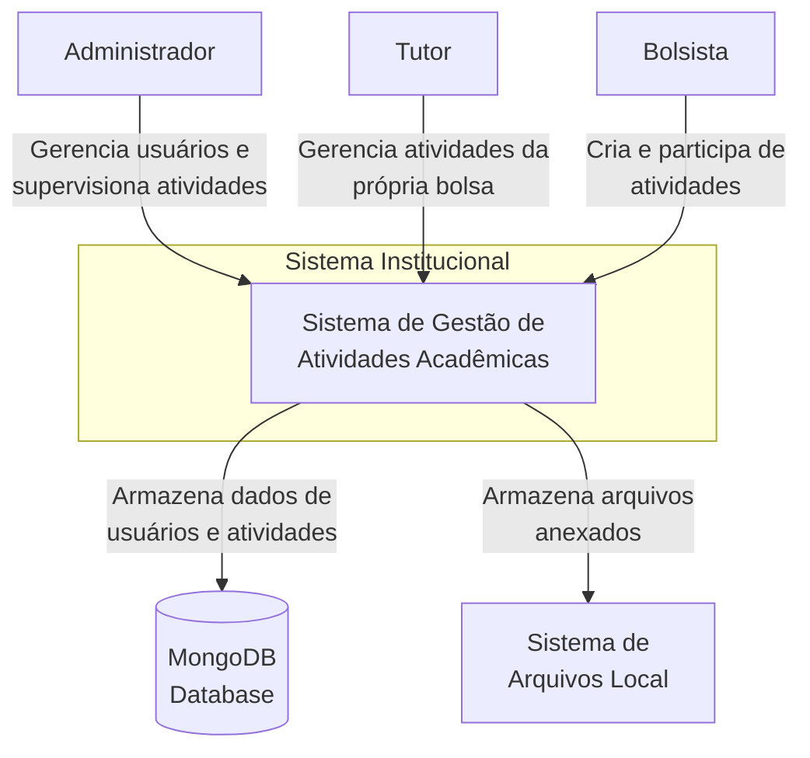
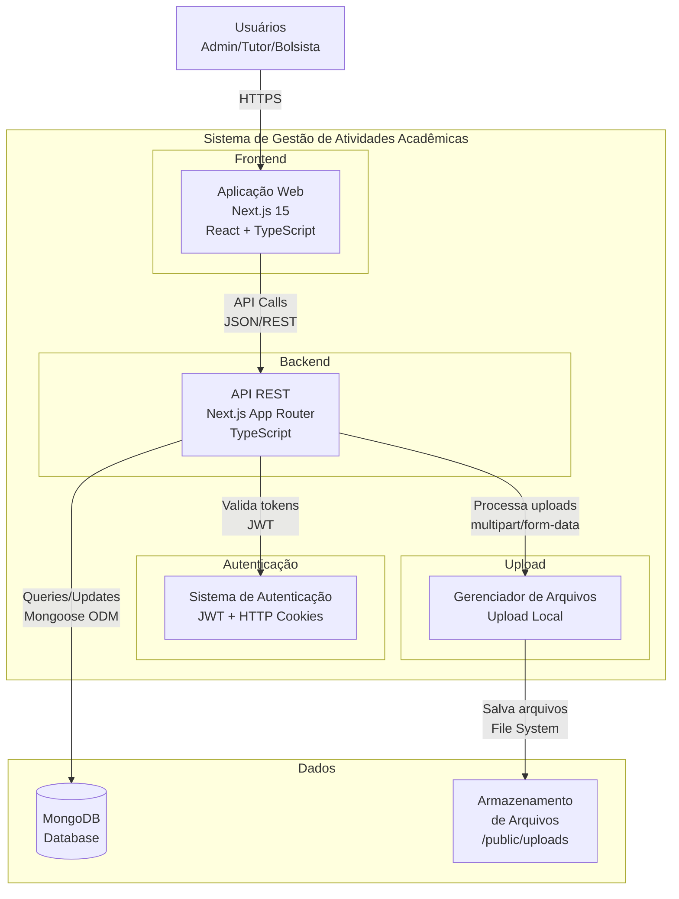
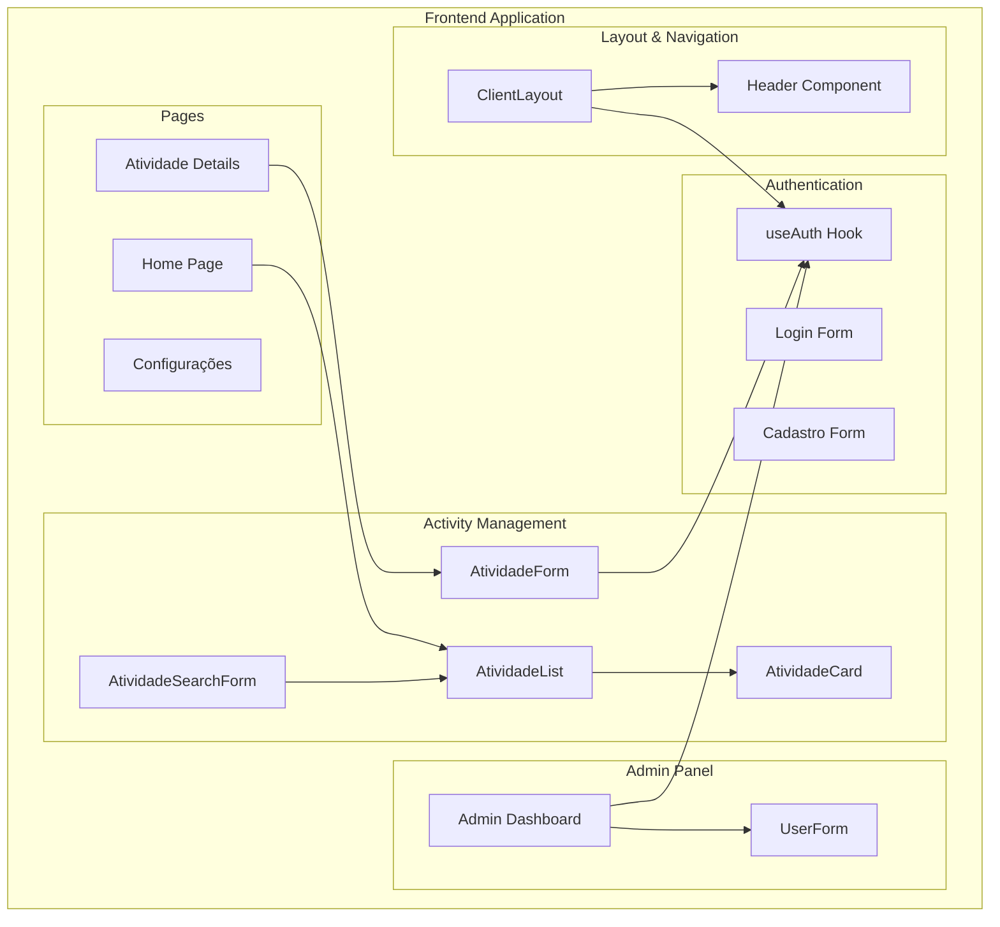
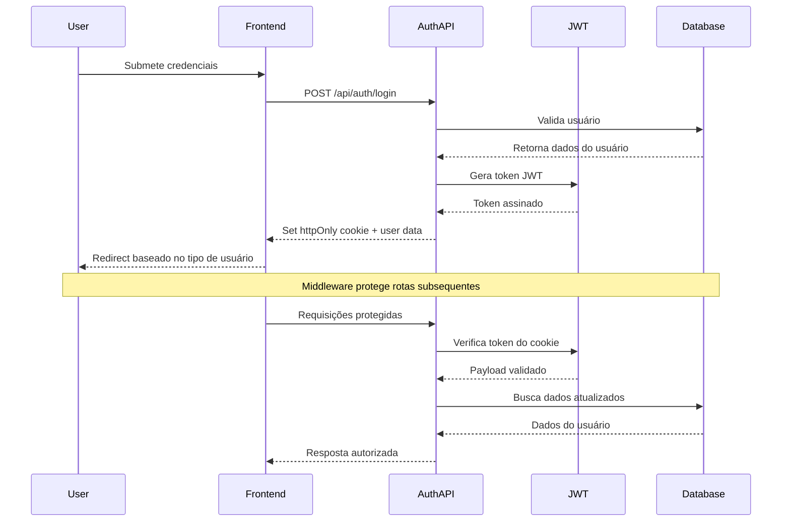
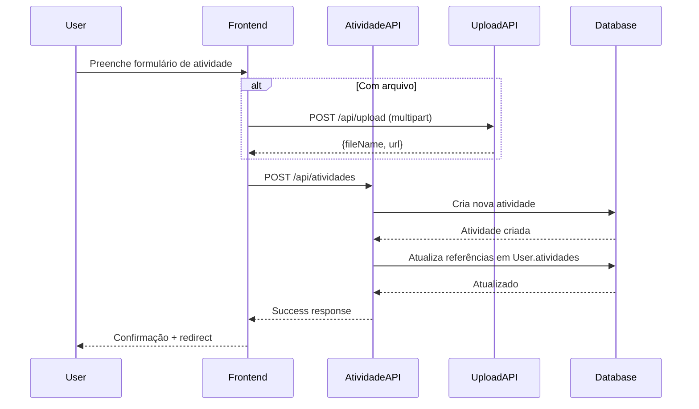
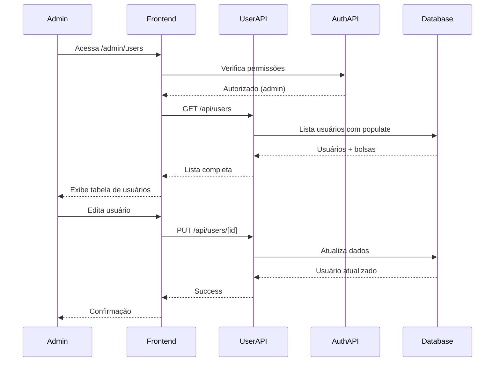

# Arquitetura C4 - Sistema de Gestão de Atividades Acadêmicas

## Visão Geral

Este documento apresenta a arquitetura do **Sistema de Gestão de Atividades Acadêmicas** utilizando o modelo C4 (Context, Containers, Components, Code). O sistema permite o gerenciamento de atividades acadêmicas com diferentes níveis de acesso para administradores, tutores e bolsistas.

---

## Nível 1: Contexto do Sistema



### Usuários do Sistema

- **Administrador**: Acesso total ao sistema, pode gerenciar todos os usuários e atividades
- **Tutor**: Gerencia atividades relacionadas à sua bolsa específica
- **Bolsista**: Cria atividades e participa das atividades às quais foi convidado

### Sistemas Externos

- **MongoDB**: Base de dados principal para armazenamento de usuários, atividades e bolsas
- **Sistema de Arquivos**: Armazenamento local para arquivos anexados às atividades

---

## Nível 2: Containers



### Descrição dos Containers

#### Frontend - Aplicação Web

- **Tecnologia**: Next.js 15 com App Router, React 19, TypeScript
- **UI Framework**: Ant Design + Tailwind CSS
- **Responsabilidades**: Interface do usuário, navegação, formulários, visualização de dados

#### Backend - API REST

- **Tecnologia**: Next.js App Router API Routes
- **Responsabilidades**: Lógica de negócio, validação, processamento de dados

#### Sistema de Autenticação

- **Tecnologia**: JWT (jsonwebtoken) + HTTP-only Cookies
- **Responsabilidades**: Login, logout, verificação de permissões, middleware de proteção

#### Gerenciador de Arquivos

- **Tecnologia**: Multer-like upload handler
- **Responsabilidades**: Upload, validação e armazenamento de arquivos

---

## Nível 3: Componentes

### Frontend Components



### Backend Services & APIs

```mermaid
graph TB
    subgraph "API Layer"
        subgraph "Route Handlers"
            AuthRoutes[/api/auth/*<br/>Login, Logout, Me]
            UserRoutes[/api/users/*<br/>CRUD Usuários]
            AtividadeRoutes[/api/atividades/*<br/>CRUD Atividades]
            BolsaRoutes[/api/bolsas/*<br/>Gerenciar Bolsas]
            UploadRoutes[/api/upload<br/>Upload Arquivos]
        end

        subgraph "Services Layer"
            AuthService[Auth Service]
            UserService[User Service]
            AtividadeService[Atividade Service]
            BolsaService[Bolsa Service]
            UploadService[Upload Service]
        end

        subgraph "Data Layer"
            UserModel[User Model<br/>Mongoose]
            AtividadeModel[Atividade Model<br/>Mongoose]
            BolsaModel[Bolsa Model<br/>Mongoose]
        end

        subgraph "Middleware"
            AuthMiddleware[Auth Middleware]
            Permissions[Permission Checker]
        end
    end

    AuthRoutes --> AuthService
    UserRoutes --> UserService
    AtividadeRoutes --> AtividadeService
    BolsaRoutes --> BolsaService
    UploadRoutes --> UploadService

    AuthService --> UserModel
    UserService --> UserModel
    AtividadeService --> AtividadeModel
    BolsaService --> BolsaModel

    AuthMiddleware --> Permissions
    AuthService --> AuthMiddleware
```

---

## Nível 4: Código (Classes e Interfaces Principais)

### Models (Mongoose Schemas)

```typescript
// User Model
interface User {
  _id: ObjectId;
  email: string;
  password: string; // bcrypt hash
  tipo: "admin" | "tutor" | "bolsista";
  name: string;
  campus: string;
  avatar?: string;
  bolsa?: ObjectId; // ref: Bolsa
  atividades?: ObjectId[]; // ref: Atividade
}

// Atividade Model
interface Atividade {
  _id: ObjectId;
  nome: string;
  descricao: string;
  campus: string;
  categoria: "Ensino" | "Pesquisa" | "Extensão" | "Outros";
  visibilidade: boolean;
  autor: ObjectId; // ref: User
  bolsistas: ObjectId[]; // ref: User
  participantes: ObjectId[]; // ref: User
  datainicio?: Date;
  datafim?: Date;
  arquivo?: {
    fileName: string;
    originalName: string;
    size: number;
    type: string;
    url: string;
  };
}

// Bolsa Model
interface Bolsa {
  _id: ObjectId;
  nome: string;
  descricao: string;
  tutor: ObjectId; // ref: User
  bolsistas: ObjectId[]; // ref: User
}
```

### Authentication Flow



### Permission System

```typescript
function checkPermission(
  user: UserPayload,
  action: string,
  targetUserId?: string
): boolean {
  switch (user.tipo) {
    case "admin":
      return true; // Admin pode tudo

    case "tutor":
      if (action === "manage-users") return true; // Mesma bolsa
      if (action === "create-activity") return true;
      return false;

    case "bolsista":
      if (action === "create-activity") return true;
      if (action === "edit-profile" && targetUserId === user.userId)
        return true;
      return false;

    default:
      return false;
  }
}
```

---

## Fluxos Principais

### 1. Criação de Atividade



### 2. Gerenciamento de Usuários (Admin)



---

## Considerações Técnicas

### Segurança

- **JWT em HTTP-only cookies** (7 dias de expiração)
- **Bcrypt** para hash de senhas
- **Middleware de autenticação** protegendo rotas sensíveis
- **Validação de permissões** baseada em tipos de usuário

### Performance

- **Turbopack** habilitado para desenvolvimento
- **Mongoose population** para relacionamentos
- **Paginação** em listagens grandes
- **Lazy loading** de componentes pesados

### Escalabilidade

- **MongoDB** com índices otimizados
- **Arquitetura modular** com services separados
- **TypeScript** para type safety
- **Next.js App Router** para SSR/SSG otimizado

### Deployment

- **Next.js build** para produção
- **MongoDB Atlas** ou instância própria
- **Variáveis de ambiente** para configuração
- **Static file serving** através do Next.js

---

## Próximos Passos / Roadmap

1. **Busca Textual**: Implementar índices de texto no MongoDB
2. **Notificações**: Sistema de notificações em tempo real
3. **Relatórios**: Dashboard com métricas e relatórios
4. **API Externa**: Integração com sistemas acadêmicos existentes
5. **Mobile**: Aplicativo móvel React Native
6. **Backup**: Sistema automatizado de backup dos dados
